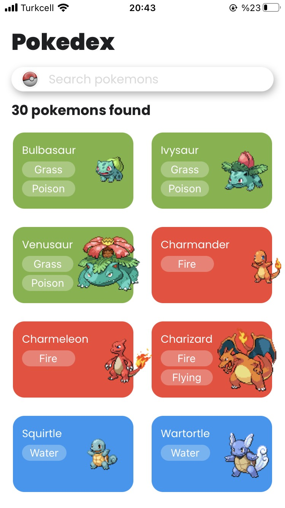
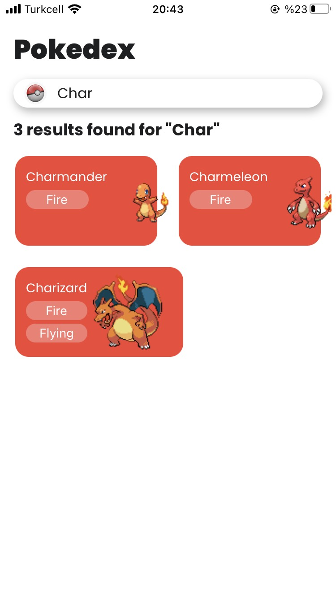
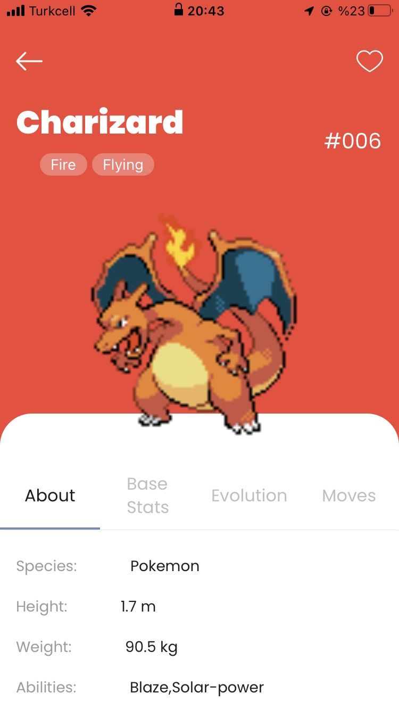
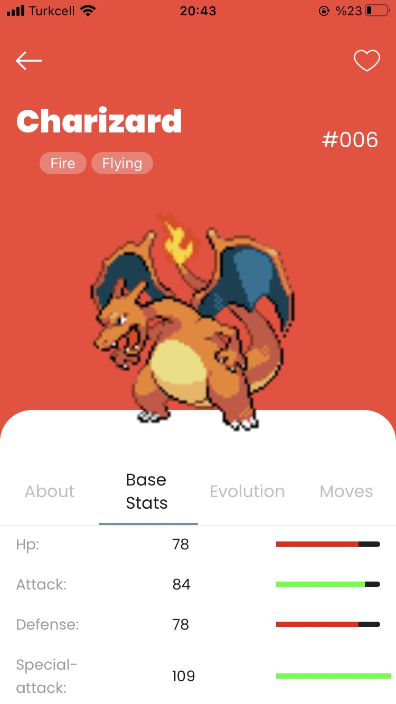
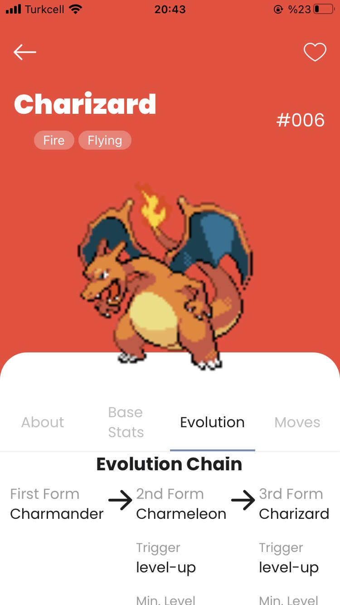
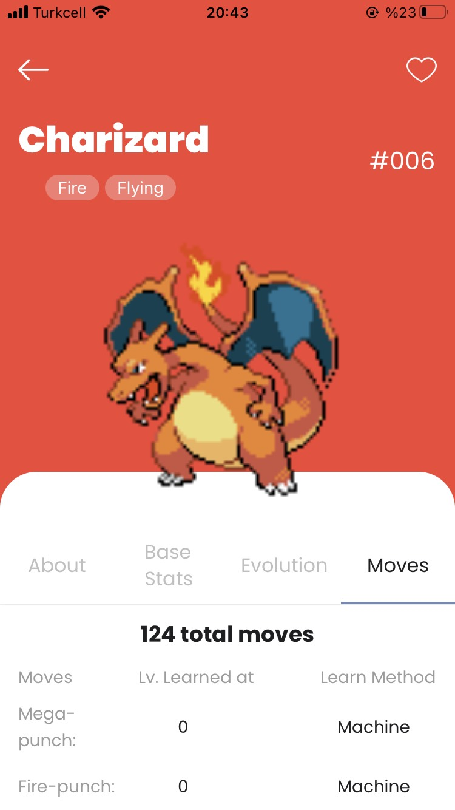

### Pokedex App with React Native

I built this app couple weeks ago and i wanted to improve it by adding some features and optimizing it.

Inspired by this design: https://dribbble.com/shots/6540871-Pokedex-App

### Used:

- **Material Top Tabs Navigator** for detail screen
- **ContextAPI** (i build the context structure but didnt use it)
- **Axios** to do API calls
- **API**: https://pokeapi.co/

### Screenshots:

<table>
  <tr>
    <td>Home Screen</td>
     <td>Search Function</td>
     <td>Detail Screen</td>
  </tr>
  
  <tr>
    <td></td>
    <td></td>
    <td></td>
  </tr>
 </table>

<table>
  <tr>
    <td>Base Stats Screen</td>
     <td>Evolution Screen</td>
     <td>Moves Screen</td>
  </tr>
  
  <tr>
    <td></td>
    <td></td>
    <td></td>
  </tr>
 </table>
